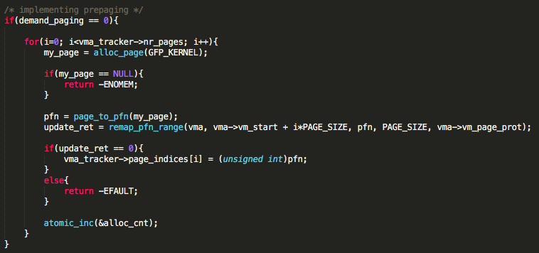
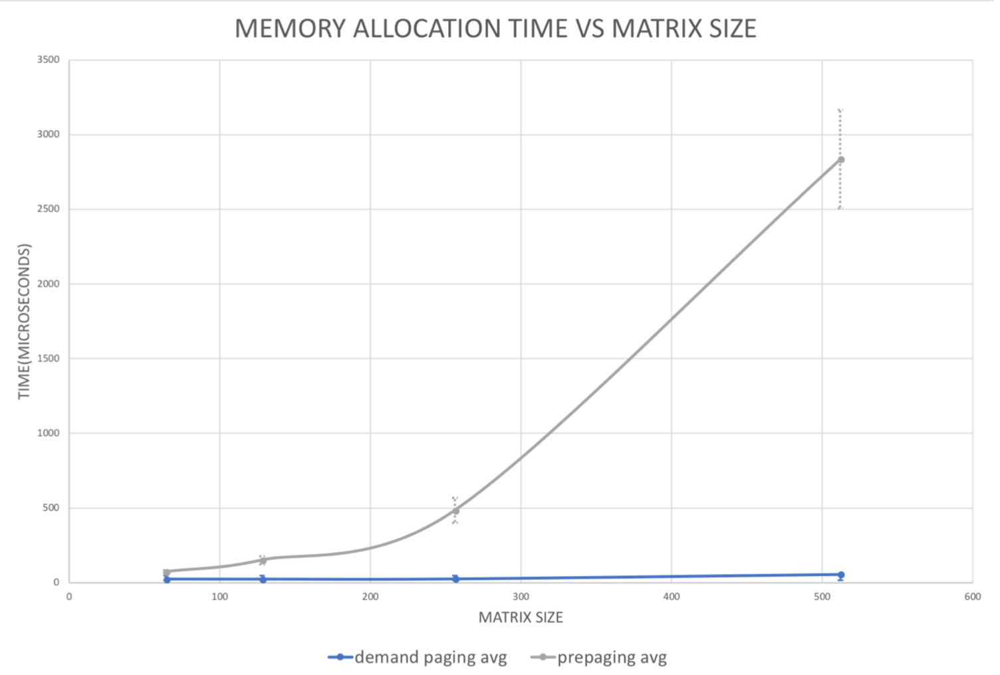
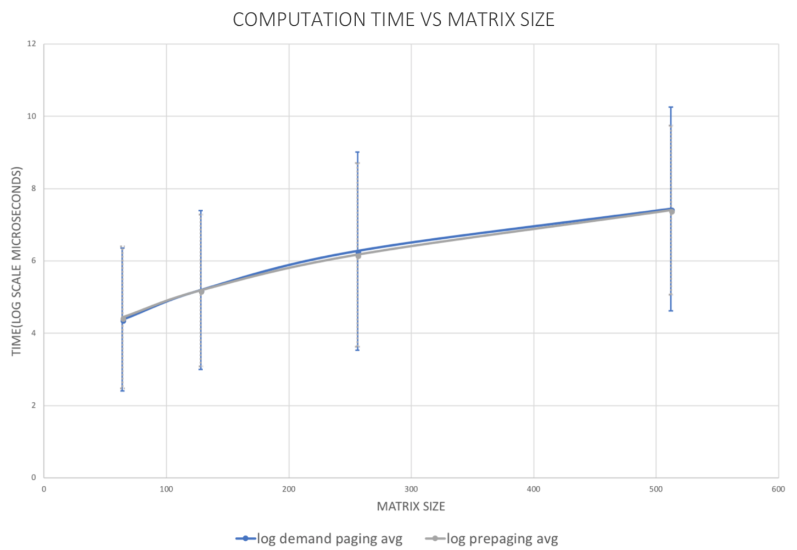
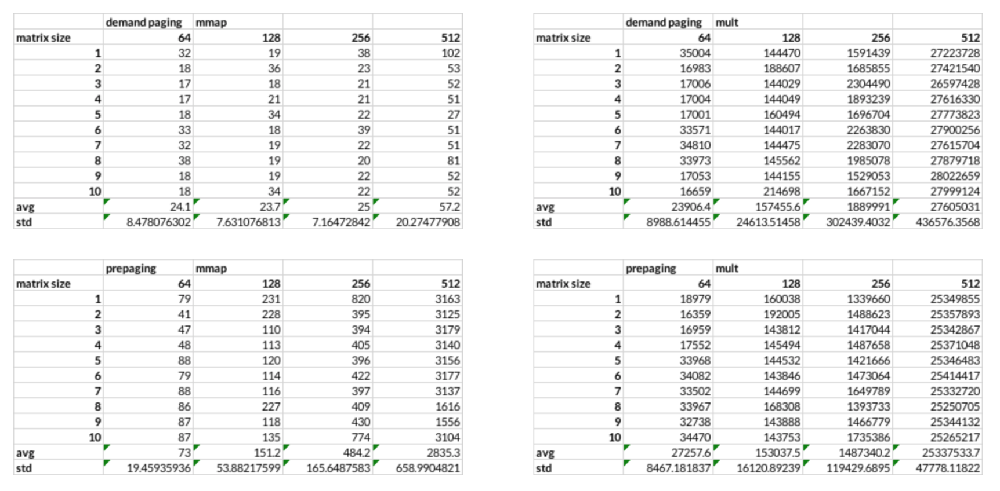
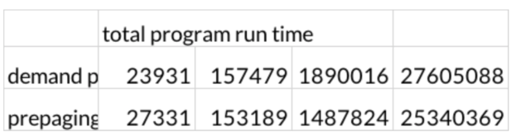
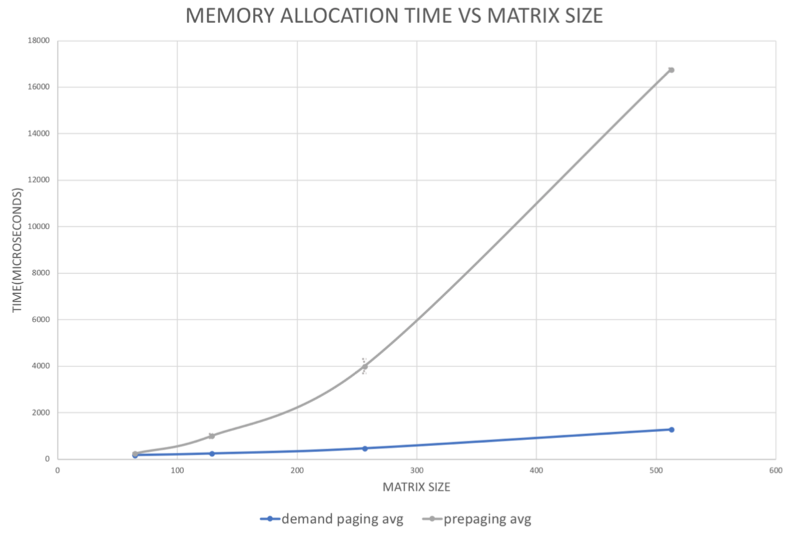
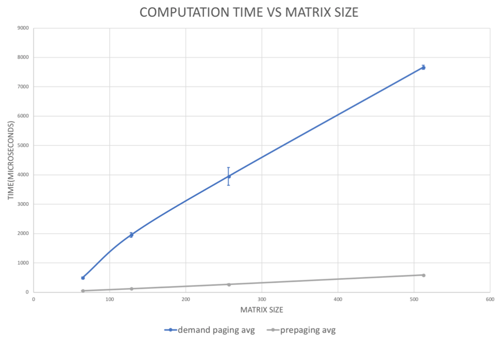
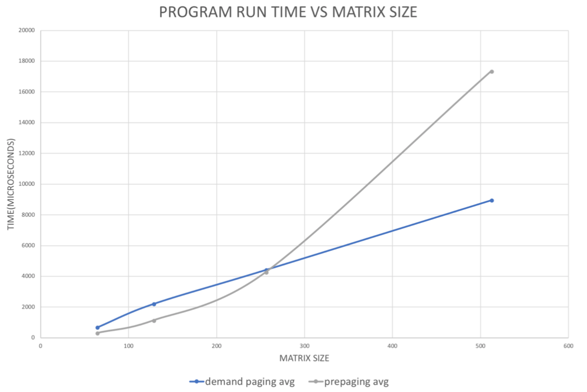

# # Spring 2018 :: CSE 422S Lab 3 - Memory Management and Paging
This lab investigates the tradeoff between making memory allocation fast and ensuring high performance for workloads that require significant memory resources. This is achieved by implementing a kernel module that provides two different techniques for virtual memory management: demand paging and allocation time paging (pre-paging).

# # Objectives
1. Implement a kernel module that leverages the *mmap*() system call to perform virtual memory mappings for a process. As in Lab 1, processes interact with module via a device file, */dev/paging*. When a process issues the *mmap*() call to this file, the module code gets invoked.
2. The module is required to perform two main tasks, when it is invoked in this fashion: (1) allocate physical memory for the process, and (2) map a new virtual address from this process to the new physical memory that we allocated for task (1).
3. The module is configured to operate in one of two modes: (1) demand paging, or (2) pre-paging.
4. Study the performance differences between two different configurations, focusing on how they affect the system call execution time for the *mmap*() call, and the runtime of a matrix multiplication application that uses the memory we map for it. 

# # Module Design
#### The implementation of the following functions can be found in [paging.c](https://github.com/HKLee93/CSE422_Lab3_Memory_Management_and_Paging/blob/master/paging.c)
 - *paging_vma_fault*(*struct vm_area_struct** *vma*, *struct vm_fault** *vmf*) - This is our page fault handler function.
 - *paging_vma_close*(*struct vm_area_struct** *vma*) - This is our close callback function.
 - *remap_pfn_range* arguments calculation: The second argument, a target user address to start a, is calculated by rounding to the nearest 4KB using PAGE_ALIGN function. The thrid argument, a physical address of the kernel memory, is calculated by allocating page first and converting allocated page to page frame number.
 - Page offset calculation: We subtract the start of the virtual memory address from where a page fault occurred and divide it by the page size.
 - pre-paging implementation is the following:
 >   
 > Inside *paging_mmap* function, we first check if demand_paging variable is set to 0. The demand_paging variable can disable "demand paging" and enable "pre-paging" by passing a value of 0 to demand_paging when we insert the module via *insmod*. If it is set to 0, we do prepaging by mapping all pages needed for the program to run. This is achieved by running a for loop by the number of nr_pages. In each loop cycle, we allocate a page from the start of the program's virtual memory address. Once the allocation succeeds, we save the allocated page frame number in our page_indices array so that we can free them at the end.

# # Module Performance
##### * Memory allocation time vs. Matrix size graph (in log scale):
The points on the plot represent the average and the vertical bars represent standard deviation (as error bars) of the 10 associated experiment.  
  

##### * Computation time vs. Matrix size graph (in log scale):
The points on the plot represent the average and the vertical bars represent standard deviation (as error bars) of the 10 associated experiment.  
  

##### * Collected data:
  

### Obvservation:
Our results suggest that pre-page mapping time is exponentially proportionate to the matrix size, while demand paging takes constant time initializing. This is because pre-paging maps all the virtual memory address prior to running the program, and as the matrix size increases, the range of vma increases.  

Although it is not visible in the graph, demand paging takes slightly longer time computing matrix multiplication, which is shown in the table above. We suggest that this is because demand paging performs page mapping as it performs multiplication and has to handle page fault asynchronously. When we add up the two time measurements and compute the total time it takes to run the program, we didn’t see significant difference but slightly better performance with pre-paging module. This is because the program allocates memory for all
the arrays that are needed for matrix multiplication and accesses all of the indices as it computes the multiples. Since demand paging module accesses all the allocated memory during the runtime of the program, the amount of page mapping needed for the program equals the number of pages. This takes approximately the same time as pre-mapping in the beginning via pre-paging module. Therefore, it takes approximately the same amount of time for handling page fault asynchronously and computing multiplication, and for pre-mapping and computing multiplication. However, we do see that for larger matrices, pre-paging performs better.

### Additional Work:
To see how each paging method performs when not all allocated memory is accessed, we implemented a trace_mm program that supposedly computes the sum of diagonal entries of a matrix. The code can be found in [trace_mm.c](https://github.com/HKLee93/CSE422_Lab3_Memory_Management_and_Paging/blob/master/trace_mm.c).

##### * Memory allocation time vs. Matrix size graph (in log scale):
  

##### * Computation time vs. Matrix size graph (in log scale):
  

##### * Program run time vs. Matrix size graph (in log scale):
  

**Hypothesis**:
We hypothesized that demand paging will take constant time page mapping and prepaging will take exponentially proportionate time. For computation, we predict that both modes will take approximately the same time as it did with dense_mm program.  

**Results**:
We observed that for allocating memory, prepaging takes exponential time depending on matrix size. However, for computing the sum of diagonal entries, we observed that demand paging takes significantly more time, whereas prepaging took barely any time. We suspect this is because the kernel never has to handle page fault with prepaging module while has to handle page fault for demand paging.  

**Analysis**:
For dense_mm program that accesses all the allocated memory, we saw that prepaging performs slightly better. We conclude that this is because demand paging has to page-map all the pages available for the program and also has to consider the overhead of invoking the page fault handler. However, for trace_mm program that allocates memory for a matrix and not access all the indices, demand paging overall performs significantly better as matrix size grows. This is because for demand paging the kernel is not mapping unnecessary virtual memory addresses.  
# # Contributors

* [Hakkyung Lee][HL] (hakkyung@wustl.edu)
* [Annie Chaehong Lee][AL] (annie.lee@wustl.edu)

[HL]: <https://github.com/hklee93>
[AL]: <https://github.com/anniechaehonglee>